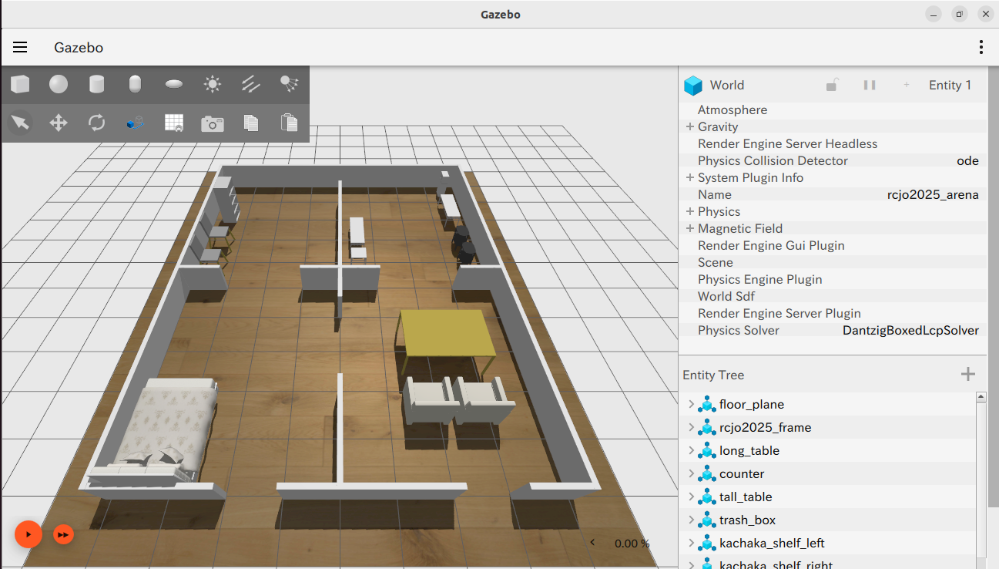

<a name="readme-top"></a>

[JA](README.md) | [EN](README.en.md)

[![Contributors][contributors-shield]][contributors-url]
[![Forks][forks-shield]][forks-url]
[![Stargazers][stars-shield]][stars-url]
[![Issues][issues-shield]][issues-url]
[![License][license-shield]][license-url]



# SOBITS Gazebo Worlds

<!--目次-->
<details>
   <summary>目次</summary>
   <ol>
    <li>
      <a href="#概要">概要</a>
    </li>
    <li>
      <a href="#セットアップ">セットアップ</a>
      <ul>
        <li><a href="#環境条件">環境条件</a></li>
        <li><a href="#インストール方法">インストール方法</a></li>
      </ul>
    </li>
    <li>
    <a href="#実行・操作方法">実行・操作方法</a>
    </li>
    <li>
      <a href="#新しいWorld作成">新しいWorld作成</a>
      <ul>
        <li><a href="#１">１</a></li>
        <li><a href="#２">２</a></li>
      </ul>
    </li>
    <li><a href="#対応家具リスト">対応家具リスト</a></li>
    <li><a href="#マイルストーン">マイルストーン</a></li>
    <li><a href="#参考文献">参考文献</a></li>
   </ol>
</details>


<!--レポジトリの概要-->
## 概要

Gazeboのファイルを複数含んだリポジトリ．
特に，家具を自由にカスタマイズできるような構成となっている．

> [!TODO]
> GUIで家具を配置したり色を着せ替えたりしながら家具を配置できるようにする予定．

<p align="right">(<a href="#readme-top">上に戻る</a>)</p>


<!-- セットアップ -->
## セットアップ

ここで，本レポジトリのセットアップ方法について説明します．

### 環境条件

まず，以下の環境を整えてから，次のインストール段階に進んでください．

| System  | Version |
| ------------- | ------------- |
| Ubuntu | 22.04 (Jammy Jellyfish) |
| ROS | Humble |
| Gazebo | ignition |

<p align="right">(<a href="#readme-top">上に戻る</a>)</p>


### インストール方法

1. ROSの`src`フォルダに移動します．
   ```sh
   $ cd ~/colcon_ws/src/
   ```
2. 本レポジトリをcloneします．
   ```sh
   $ git clone -b humble-devel https://github.com/TeamSOBITS/sobits_gazebo_worlds.git
   ```
3. レポジトリの中へ移動します．
   ```sh
   $ cd sobits_gazebo_worlds/
   ```
4. 依存パッケージをインストールします．
   ```sh
   $ bash install.sh
   ```
5. パッケージをコンパイルします．
   ```sh
   $ cd ~/colcon_ws/
   $ colcon build --symlink-install
   ```

<p align="right">(<a href="#readme-top">上に戻る</a>)</p>


<!-- 実行・操作方法 -->
## 実行・操作方法

1. worldファイルを指定 \
   [sobits_gazebo_worlds/launch/world.launch.py](launch/world.launch.py)の`world_file_path`を指定する．\
   worldファイルは何でもいいが，例えばこのリポジトリ内であれば，[このフォルダ(sobits_gazebo_worlds/worlds/)](worlds/)に存在する．

2. [world.launch.py](launch/world.launch.py)というlaunchファイルを起動
   ```sh
   $ ros2 launch sobits_gazebo_worlds world.launch.py
   ```
   これによってGazeboを起動することができます．

3. [任意] ロボットをGazebo環境内で動かしてみよう\
   Gazebo対応しているロボットのリポジトリから，Gazeboのworldファイルを指定．\
   また，ロボットの初期位置も設定することもできるので注意．

<p align="right">(<a href="#readme-top">上に戻る</a>)</p>


<!-- 新しいWorld作成 -->
## 新しいWorld作成

新しいWorldの作り方．

[TODO] GUIによって簡単に家具を配置できるようにする．

### １
### ２


<!-- 対応家具リスト -->
## 対応家具リスト

このリポジトリが保有する家具のリスト．

[TODO] 未対応

<!-- マイルストーン -->
## マイルストーン

- [ ] TODO
- [x] TODO

現時点のバッグや新規機能の依頼を確認するために[Issueページ][issues-url] をご覧ください．

<p align="right">(<a href="#readme-top">上に戻る</a>)</p>


<!-- 参考文献 -->
## 参考文献

* [ROS Humble](http://wiki.ros.org/humble)
* [WRS Gazebo](https://github.com/TeamSOBITS/tmc_wrs_gz.git)
* [AWS Gazebo](https://github.com/TeamSOBITS/aws_small_house_world.git)


[contributors-shield]: https://img.shields.io/github/contributors/TeamSOBITS/sobits_gazebo_worlds.svg?style=for-the-badge
[contributors-url]: https://github.com/TeamSOBITS/sobits_gazebo_worlds/graphs/contributors
[forks-shield]: https://img.shields.io/github/forks/TeamSOBITS/sobits_gazebo_worlds.svg?style=for-the-badge
[forks-url]: https://github.com/TeamSOBITS/sobits_gazebo_worlds/network/members
[stars-shield]: https://img.shields.io/github/stars/TeamSOBITS/sobits_gazebo_worlds.svg?style=for-the-badge
[stars-url]: https://github.com/TeamSOBITS/sobits_gazebo_worlds/stargazers
[issues-shield]: https://img.shields.io/github/issues/TeamSOBITS/sobits_gazebo_worlds.svg?style=for-the-badge
[issues-url]: https://github.com/TeamSOBITS/sobits_gazebo_worlds/issues
[license-shield]: https://img.shields.io/github/license/TeamSOBITS/sobits_gazebo_worlds.svg?style=for-the-badge
[license-url]: LICENSE
