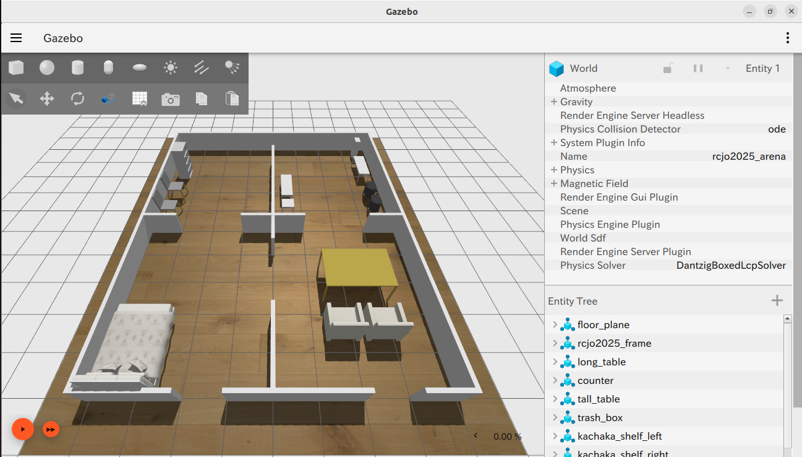

<a name="readme-top"></a>

[EN](README.md) | [JA](README.ja.md)

[![Contributors][contributors-shield]][contributors-url]
[![Forks][forks-shield]][forks-url]
[![Stargazers][stars-shield]][stars-url]
[![Issues][issues-shield]][issues-url]
[![License][license-shield]][license-url]



# SOBITS Gazebo Worlds

<!-- Table of contents -->
<details>
   <summary>Table of Contents</summary>
   <ol>
    <li>
      <a href="#overview">Overview</a>
    </li>
    <li>
      <a href="#setup">Setup</a>
      <ul>
        <li><a href="#requirements">Requirements</a></li>
        <li><a href="#installation">Installation</a></li>
      </ul>
    </li>
    <li>
    <a href="#usage">Usage</a>
      <ul>
        <li><a href="#launch-a-fixed-world">Launch a Fixed World</a></li>
        <li><a href="#launch-a-random-world">Launch a Random World</a></li>
        <li><a href="#regenerate-a-random-world-at-runtime">Regenerate a Random World at Runtime</a></li>
      </ul>
    </li>
    <li>
    <a href="#creating-a-new-world">Creating a New World</a>
      <ul>
        <li><a href="#create-a-placement-area-yaml">Create a Placement-Area YAML</a></li>
        <li><a href="#use-the-random-generation-launch">Use the Random-Generation Launch</a></li>
      </ul>
    </li>
    <li>
    <a href="#worlds-and-furniture-models">Worlds and Furniture Models</a>
      <ul>
        <li><a href="#supported-furniture-list">Supported Furniture List</a></li>
        <li><a href="#adding-a-new-glb-furniture-model">Adding a New GLB Furniture Model</a></li>
      </ul>
    </li>
    <li><a href="#milestones">Milestones</a></li>
    <li><a href="#references">References</a></li>
   </ol>
</details>


<!-- Repository overview -->
## Overview

A repository bundling multiple Gazebo (ignition) world files.
It is structured so that furniture can be freely customized.

The following features are currently supported:

- Launching worlds with fixed furniture layouts
- Random placement of YCB objects
- Placement-surface configuration via YAML
- Placement-surface size/height estimation from a furniture model's `model.sdf`
- Multi-surface specification for shelves (e.g. `plate1` / `plate2` / `plate3`)
- Object-category restriction via `allowed_categories`
- Automatic spawning of `gz_human_sim` human models via `human_count`
- Additional spawning of objects/people from GPSR commands
- Human teleop launch for follow-type GPSR tasks
- Saving generated worlds
- Runtime regeneration of random objects via ROS 2 services

> [!TODO]
> Planned: place and re-color furniture interactively through a GUI.

<p align="right">(<a href="#readme-top">back to top</a>)</p>


<!-- Setup -->
## Setup

This section explains how to set up this repository.

### Requirements

First prepare the following environment, then proceed to the installation step.

| System  | Version |
| ------------- | ------------- |
| Ubuntu | 24.04 (Noble Numbat) |
| ROS | Jazzy |
| Gazebo | ignition |

> [!NOTE]
> For how to install `Ubuntu` and `ROS`, refer to the [SOBIT Manual](https://github.com/TeamSOBITS/sobits_manual#%E9%96%8B%E7%99%BA%E7%92%B0%E5%A2%83%E3%81%AB%E3%81%A4%E3%81%84%E3%81%A6).

### Installation

1. Move to the `src` folder of your ROS workspace.
   ```sh
   $ cd ~/colcon_ws/src/
   ```
2. Clone this repository.
   ```sh
   $ git clone -b humble-devel https://github.com/TeamSOBITS/sobits_gazebo_worlds.git
   ```
3. Move into the repository.
   ```sh
   $ cd sobits_gazebo_worlds/
   ```
4. Install the dependencies.
   ```sh
   $ bash install.sh
   ```
5. Build the package.
   ```sh
   $ cd ~/colcon_ws/
   $ colcon build --symlink-install
   ```

<p align="right">(<a href="#readme-top">back to top</a>)</p>


<!-- Usage -->
## Usage

### Launch a Fixed World

1. Specify the world file\
   Set `world_file_path` in [world.launch.py](launch/world.launch.py).\
   World files live in [this folder](worlds/).

2. Launch the [world.launch.py](launch/world.launch.py) launch file.
   ```sh
   $ ros2 launch sobits_gazebo_worlds world.launch.py
   ```
   This starts Gazebo.

3. [Optional] Try driving a robot inside the Gazebo environment\
   From a Gazebo-compatible robot repository, point it to the Gazebo world file.\
   Note that you can also set the robot's initial pose.

### Launch a Random World

Using [random_world.launch.py](launch/random_world.launch.py), you can generate and launch a world that randomly places YCB objects and people on top of the fixed furniture base.

```sh
$ ros2 launch sobits_gazebo_worlds random_world.launch.py
```

The main arguments are as follows.

| Argument | Description |
| --- | --- |
| `base_world` | Base world file |
| `placement_config` | Placement-surface YAML |
| `models_root` | Root directory of the YCB models |
| `seed` | Random seed |
| `object_count` | Number of YCB objects to place randomly |
| `human_count` | Number of human models to spawn |
| `human_model` | Human model name, e.g. `person_standing` |
| `task_command` | Command string that triggers extra spawns based on a GPSR task sentence |
| `gpsr_groq_model` | Model name used via `groq_ros` |
| `save_world` | Whether to save the generated world |
| `output_world_name` | Name of the saved world; if the extension is omitted, `.world.xacro` is appended automatically |

Example:

```sh
$ ros2 launch sobits_gazebo_worlds random_world.launch.py \
    object_count:=15 \
    human_count:=3 \
    seed:=42
```

Example that saves the generated world:

```sh
$ ros2 launch sobits_gazebo_worlds random_world.launch.py \
    save_world:=true \
    output_world_name:=rcjo2025_version_1
```

In this case it is saved to `worlds/rcjo2025_version_1.world.xacro`.

Example that spawns extra items from a GPSR command:

```sh
$ ros2 launch sobits_gazebo_worlds random_world.launch.py \
    task_command:="Grasp an apple on the tall table in the living room and place it on the shelf in study_room." \
    object_count:=15 \
    human_count:=2
```

To use this feature, the `groq_action` server of `groq_ros` must be running beforehand.
Objects are added according to the `room_name#furniture_name` defined in the placement-area YAML, and people are added near the furniture of the target room via `gz_human_sim`.

Example of a follow-type task:

```sh
$ ros2 launch sobits_gazebo_worlds random_world.launch.py \
    task_command:="Follow Alex in the bedroom." \
    object_count:=15
```

In this case the target person is launched with `enable_teleop:=true` and can be operated via `sobits_teleop`.

### Regenerate a Random World at Runtime

With `random_world.launch.py`, ROS 2 services are available to delete and regenerate only the randomly placed YCB objects after launch.
You can update the random layout without restarting Gazebo or the robot.

Available services:

| Service | Type | Description |
| --- | --- | --- |
| `/random_world/regenerate` | `std_srvs/srv/Trigger` | Delete the current random objects and regenerate them |
| `/sobits_gazebo_worlds/change_world` | `std_srvs/srv/Trigger` | Same behavior as `/random_world/regenerate` |
| `/random_world/clear` | `std_srvs/srv/Trigger` | Delete only the current random objects |

Basic usage:

1. First launch a random world.

   ```sh
   $ ros2 launch sobits_gazebo_worlds random_world.launch.py
   ```

2. Delete all random objects.

   ```sh
   $ ros2 service call /random_world/clear std_srvs/srv/Trigger {}
   ```

3. Generate a new random layout.

   ```sh
   $ ros2 service call /random_world/regenerate std_srvs/srv/Trigger {}
   ```

`/random_world/regenerate` targets only the randomly placed YCB objects.
The robot itself, the fixed furniture, and the base world are not deleted.

To regenerate deterministically, change the `random_world_manager` parameters before calling the service.

```sh
$ ros2 param set /random_world_manager seed "123"
$ ros2 param set /random_world_manager object_count 20
$ ros2 service call /random_world/regenerate std_srvs/srv/Trigger {}
```

To return to non-deterministic regeneration:

```sh
$ ros2 param set /random_world_manager seed ""
```

Main runtime parameters:

| Parameter | Description |
| --- | --- |
| `seed` | Non-deterministic when empty; specify an integer string to reproduce a layout |
| `object_count` | Number of YCB objects placed on regeneration |
| `pause_physics_during_reconfigure` | Whether to pause physics during deletion/re-spawning |

> [!IMPORTANT]
> This runtime-regeneration feature assumes that `random_world.launch.py` is running.
> `ros2 launch sobit_home_bringup gz_minimal.launch.py` and `ros2 launch sobits_gazebo_worlds random_world.launch.py` both start Gazebo, so do not use them on the same simulation at the same time.

> [!NOTE]
> To use the same feature on the `gz_minimal.launch.py` side, you need to add bridges for `/world/<world_name>/create`, `/remove`, and `/control`, plus `random_world_manager.py`, against the existing Gazebo instance.

<p align="right">(<a href="#readme-top">back to top</a>)</p>


<!-- Creating a new world -->
## Creating a New World

How to create a new world.

[TODO] Make it easy to place furniture through a GUI.

### Create a Placement-Area YAML

Placement areas are specified in YAML files under [config/placement](config/placement/).

Example:

```yaml
placement_areas:
  - name: living_room#long_table
    edge_margin: 0.08
    min_object_spacing: 0.13

  - name: study_room#shelf
    surface_name: plate1
    # allowed_categories: [kitchen_item]
    edge_margin: 0.05
    min_object_spacing: 0.10
```

The main keys are as follows.

| Key | Description |
| --- | --- |
| `name` | Furniture include name in the world |
| `surface_name` | Surface name used for shelves etc.; defaults to `top` if unspecified |
| `edge_margin` | Safety margin [m] excluded from the furniture edge |
| `min_object_spacing` | Minimum distance [m] between objects on the same surface |
| `allowed_categories` | Allowed YCB categories; all categories if unspecified |
| `selection_weight` | Weight that makes a surface more likely to be chosen |
| `max_objects` | Maximum number of objects that can be placed on the surface |

You usually do not need to write `size` or `z`.\
They are estimated automatically from the furniture's `model.sdf` and its pose in the world.

### Use the Random-Generation Launch

Launch with the YAML you created.

```sh
$ ros2 launch sobits_gazebo_worlds random_world.launch.py \
    base_world:=/home/rg-station-03/colcon_ws/src/sobits_gazebo_worlds/worlds/rcjo2025_arena.world.xacro \
    placement_config:=/home/rg-station-03/colcon_ws/src/sobits_gazebo_worlds/config/placement/rcjo2025_arena.yaml \
    object_count:=20 \
    human_count:=2
```

Human models are automatically sampled from the free area on the `floor_plane` and placed so they do not overlap furniture.
People added by GPSR tasks are likewise placed around the target room while avoiding collisions.


<!-- Worlds and furniture models -->
## Worlds and Furniture Models

World files live in [worlds/](worlds/) and furniture models in [models/](models/).
Worlds are written as `.world.xacro` and can be launched directly (fixed layout) or fed to
the random-placement launch as a base world. The models fall into two families:

- **Legacy / shared models** (unprefixed) such as `long_table`, `tall_table`,
  `dining_table`, `shelf`, `sofa`, `bed`, `kachaka_shelf` — used by the older arenas and by
  the random-placement system.
- **Real-furniture GLB models** (`rcw26_*`) — embedded-texture GLB meshes scaled to
  real-world dimensions, described below.

### Supported Furniture List

Furniture with defined placement surfaces (used by the random-placement system):

- `long_table`
- `tall_table`
- `dining_table`
- `counter`
- `shelf`
  - `top`
  - `plate1`
  - `plate2`
  - `plate3`

Notes:

- When a furniture surface is defined as a `box` shape, its size is estimated automatically.
- Some mesh furniture such as `sofa` / `bed` / `kachaka_shelf` uses a conservative internal footprint for human spawning.


### Adding a New GLB Furniture Model

The source GLBs live in `real_furniture/` (untracked). To add one:

1. **Fix the GLB so it renders in Gazebo ogre2.** Raw GLBs from the source set are broken
   three ways and must all be fixed (edit in place with `pygltflib`, **not** `trimesh`,
   which rescales the geometry to a cube):
   - Add per-vertex **`NORMAL`** — without normals there is no lighting and the mesh
     renders **black**.
   - Set **`metallicFactor = 0`** — a fully-metallic surface with no environment map
     renders **black**.
   - Add a texture **sampler** (and strip `baseColorFactor` / `emissiveFactor` /
     `alphaMode`, set `doubleSided=true`) — without a sampler the texture is not bound and
     the mesh renders **white**.
2. Package it as `models/rcw26_<name>/` with `model.config`, `model.sdf`, and
   `meshes/<name>.glb`. GLBs are **Y-up** and unit-normalized, so `model.sdf` applies
   `roll=1.5708` (Y-up -> Z-up) and a uniform `<scale> = target_height / GLB_Y_extent`,
   with the collision/visual raised by `height/2` to rest on the floor.
3. Reference it in a world with `<uri>model://rcw26_<name></uri>`.

> [!NOTE]
> For the floor, include the existing `wrc_ground_plane` model rather than authoring a
> custom plane — its material carries the `<diffuse>` term that makes the wood texture
> render (a bare `<plane>` + `albedo_map` renders black).

<p align="right">(<a href="#readme-top">back to top</a>)</p>


<!-- Milestones -->
## Exporting to USD (Isaac Sim) and MJCF (MuJoCo)

[scripts/export_sim_formats.py](scripts/export_sim_formats.py) expands each `.world.xacro`
(`closed:=false|true`) to SDF, then runs `sdf2usd` (gz-usd) and `sdf2mjcf` (gz-mujoco) with
this package's `models/`, `tmc_wrs_gz_worlds/models` and `gz_human_sim/models` as resource
paths. Failures do not stop the run; a summary table is printed and the exit code is non-zero
if any target failed.

```bash
USD_PATH=/opt/openusd-24.08 SDF2USD_BIN=<path>/gz-usd/build/bin/sdf2usd \
SDF2MJCF_BIN=~/venvs/sdf2mjcf/bin/sdf2mjcf \
python3 scripts/export_sim_formats.py --closed both --models --out export
```

Use `--dry-run` to only expand the xacro and print the converter commands (`--help` lists
everything). Narrow the export with:

```bash
... export_sim_formats.py --formats usd                   # USD only (or --formats mjcf)
... export_sim_formats.py --worlds rcw2026_arena          # one world
... export_sim_formats.py --no-worlds --models rcw26_shelf rcw26_door   # two models only
```

`--models` without names exports every model; unknown names are an error.

```
export/sdf/<world>[_closed].sdf            expanded SDF
export/usd/<world>[_closed].usda           (+ materials/ textures)
export/mjcf/<world>[_closed]/<world>.xml   (+ assets/)
export/usd/models/<m>/<m>.usda, export/mjcf/models/<m>/<m>.xml   (with --models)
```

After conversion the driver applies `scripts/postprocess_usd.py` to `export/usd` when `pxr` is importable;
otherwise run it yourself with the IsaacLab venv. It authors `physxArticulation:sleepThreshold = 0` on every
articulation root (doors): PhysX 110.3 / Isaac Sim 6.1 freezes the GPU articulation solver when an
articulation falls asleep while a tensor-API view (ros2_control, IMU, Isaac Lab) exists, see
`urdf2usd_ros/docs/isaac_gpu_articulation_sleep_stall.md`. `validate_usd.py` fails on roots without it.

Validate with `scripts/validate_usd.py export/usd` (IsaacLab venv: pxr, optional Newton
load) and `scripts/validate_mjcf.py export/mjcf` (MuJoCo load, stepping, renders).

**Sharing the assets.** `export/` is not tracked in git (`.gitignore`). Download the
published assets instead of regenerating them, and publish again after regenerating:

```bash
python3 scripts/download_sim_assets.py --formats usd --worlds rcw2026_arena --models rcw26_shelf
python3 scripts/publish_sim_assets.py --tag v1      # needs HF_TOKEN or `hf auth login`; --dry-run lists files
```

Both default to the dataset `team-sobits/sobits_sim_assets` (`--repo-id`). Publishing copies the dataset card [docs/hf_dataset_card.md](docs/hf_dataset_card.md) to
`export/README.md` and writes
`export/MANIFEST.json` (date, git SHAs, driver command, counts, size) and skips `_renders/` and logs.
Download narrows by `--formats usd,mjcf,sdf`, `--worlds`, `--models`, takes `--revision`
(branch or tag) and `--force`, and needs no token for public repos.

**Robot assets.** The dataset also hosts per-robot assets generated by
[urdf2usd_ros](https://github.com/TeamSOBITS/urdf2usd_ros) (USD) and `scripts/usd2mjcf.py` (MJCF) from the robot
description repos. `import_robot_assets.py` copies them to `export/usd/robots/<robot>/` (with `<robot>_ros2_control.yaml`, the
controller_manager config of the USD's `ROS2_Control` graph) and
`export/mjcf/robots/<robot>/` and writes `export/robots/<robot>.json` (description commit, descriptor sha256,
urdf2usd_ros commit, Isaac Sim version, date). Publishing adds them to `MANIFEST.json` (`robots`); `--robots`
narrows both publish and download.

```bash
python3 scripts/import_robot_assets.py --robot sobit_home     # urdf2usd_ros/output -> export/ + robots/<robot>.json
python3 scripts/publish_sim_assets.py --dry-run --robots sobit_home --formats usd,mjcf
python3 scripts/download_sim_assets.py --formats usd,mjcf --robots sobit_home
```

**Known limitations**
- MuJoCo: collision meshes are split into convex parts with CoACD (default; `--no-convex-decomposition` gives single hulls, `--coacd-threshold F` tunes it); plugins
  are dropped, so doors (`JointPositionController`) are not driven; only diffuse textures
  are exported.
- Isaac Sim: lights are scaled x1000 / x30000 to match Gazebo brightness; metalness 0.5
  is treated as unset.
- `person_walking` (actor) is not exportable.

**Inertia warning.** Before converting, the driver prints
`WARNING: <model> link <link>: mass without <inertia>; identity tensor assumed` for every
non-static link that has a `<mass>` but no `<inertia>` (sdformat then uses 1 kg m^2 per
axis, which is unrealistic in Gazebo, Isaac and MuJoCo alike), and a similar warning for
links without any `<inertial>`. Currently affected: `book_shelf`, `chair`, `sofa`,
`wrc_long_table`, `wrc_tall_table` (mass without inertia), `rcw26_door` (`door_link`;
`hinge_link` has no inertial) and `floor_plane`. Fix by authoring an `<inertia>` block in the
model's `model.sdf`.

## Isaac Sim

Isaac Sim 6.1 runs on the host, not in the ROS container. The container drives it through the
`simulation_interfaces` services of the `isaacsim.ros2.sim_control` extension. Nothing from Isaac is installed in the container.

### Host Prerequisites

- Isaac Sim 6.1 (pip) in the IsaacLab uv venv `~/Documents/IsaacLab/.venv`, and `uv` on `PATH`.
- Once, install the Jazzy position/velocity controller plugins that Isaac does not bundle into `~/.cache/urdf2usd_ros/ros2_jazzy_extra`
  (`<src>` is the workspace `src` directory):
  ```sh
  $ cd ~/Documents/IsaacLab && uv run --no-sync python <src>/urdf2usd_ros/scripts/fetch_ros2_controllers.py
  ```
- Link the workspace so the asset paths sent by the container (`~/colcon_ws/src/sobits_gazebo_worlds/export/...`) also resolve on the host:
  ```sh
  $ ln -s ~/docker_containers/jazzy_sobit_home_2_moveit_ws ~/colcon_ws
  ```
  Alternatively, pass `asset_root:=<host path to export>` to the launch file.
- Assets from `scripts/download_sim_assets.py` (v0.4.0 or later for Isaac) or a local export.
- `urdf2usd_ros` next to this package (`URDF2USD_ROS` overrides it); the runner imports its `utils/`.

### Start the Runner

Start the runner by hand on the host and leave it running. It enables the ROS 2 bridge and `isaacsim.ros2.sim_control`, then idles.
The default domain is 69 (not the shell's `ROS_DOMAIN_ID`), RMW is CycloneDDS, and the CycloneDDS URI is `sobit_home/cyclonedds_local.xml` (loopback).

```sh
$ scripts/isaac_sim.sh [--headless] [--domain 69] [--rmw rmw_cyclonedds_cpp] [--cyclonedds-uri file://…]
$ scripts/isaac_sim.sh --world export/usd/rcw2026_arena.usda --robot export/usd/robots/sobit_home/sobit_home.usd --pose -6 1.5 0 0 --play
```

`--world` and `--robot` are for a quick host-only check without the container. The runner prints `READY …` when idle.

| Variable | Default | Description |
| --- | --- | --- |
| `ISAACSIM_PYTHON` | (unset) | Python with `isaacsim` installed. Takes precedence over `ISAACLAB_DIR`. |
| `ISAACLAB_DIR` | `~/Documents/IsaacLab` | IsaacLab checkout whose `.venv` is used through `uv run --no-sync`. |
| `URDF2USD_ROS` | `../urdf2usd_ros` | `urdf2usd_ros` checkout. |

### Service Cheat-Sheet

Run in the container as `ros2 run sobits_gazebo_worlds isaac_sim_control.py <command>`.
Exit codes: 0 ok, 1 service error, 2 service unavailable. Every command accepts `--timeout S`.

| Command | Description |
| --- | --- |
| `wait` | Wait until the simulator answers. |
| `state {play,pause,stop}` | Set the simulation state. |
| `load-world URI [--if-different]` | Load a USD world (stops the sim first). `--if-different` skips it when the same world is already loaded. |
| `spawn NAME URI [--pose X Y Z YAW] [--namespace NS] [--allow-renaming] [--replace]` | Spawn a USD entity at prim `/NAME`. `--replace` deletes an existing `NAME` first. |
| `delete NAME [--ignore-missing]` | Delete the entity at `/NAME`. |
| `reset` | Remove only service-spawned entities. |

`delete` and `reset` do not tear a robot down cleanly: its sensor writers and in-process controller_manager outlive the prim and keep re-authoring it, so a respawn under the same name fails. Reload the world instead (`isaac_minimal.launch.py` does).
| `entities [--filter REGEX]` | List entity prim paths, filtered by a regex on the prim path. |

The runner adds a physics scene to every opened stage that has none on its root layer, and a `/clock` graph.
On each spawned robot it rewrites the baked absolute `controllerConfig` path to the `<robot>_ros2_control.yaml` next to the USD.

For the robot bringup command, see [Run on Isaac Sim](../sobit_home/README.md#run-on-isaac-sim) in the sobit_home README.

## Milestones

- [x] Random YCB placement on top of fixed furniture
- [x] Human-model spawning via `gz_human_sim`
- [ ] GUI-based furniture placement editing

See the [Issues page][issues-url] to check current bugs and feature requests.

<p align="right">(<a href="#readme-top">back to top</a>)</p>


<!-- References -->
## References

* [ROS Jazzy](http://wiki.ros.org/jazzy)
* [WRS Gazebo](---)
* [AWS Gazebo](---)


[contributors-shield]: https://img.shields.io/github/contributors/TeamSOBITS/sobits_gazebo_worlds.svg?style=for-the-badge
[contributors-url]: https://github.com/TeamSOBITS/sobits_gazebo_worlds/graphs/contributors
[forks-shield]: https://img.shields.io/github/forks/TeamSOBITS/sobits_gazebo_worlds.svg?style=for-the-badge
[forks-url]: https://github.com/TeamSOBITS/sobits_gazebo_worlds/network/members
[stars-shield]: https://img.shields.io/github/stars/TeamSOBITS/sobits_gazebo_worlds.svg?style=for-the-badge
[stars-url]: https://github.com/TeamSOBITS/sobits_gazebo_worlds/stargazers
[issues-shield]: https://img.shields.io/github/issues/TeamSOBITS/sobits_gazebo_worlds.svg?style=for-the-badge
[issues-url]: https://github.com/TeamSOBITS/sobits_gazebo_worlds/issues
[license-shield]: https://img.shields.io/github/license/TeamSOBITS/sobits_gazebo_worlds.svg?style=for-the-badge
[license-url]: LICENSE
